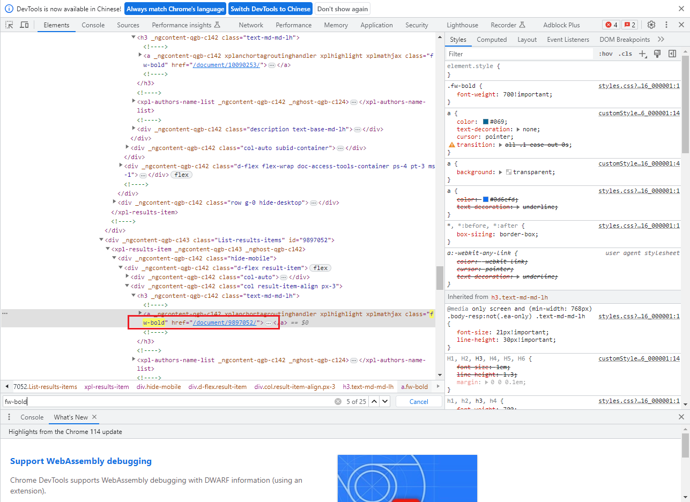
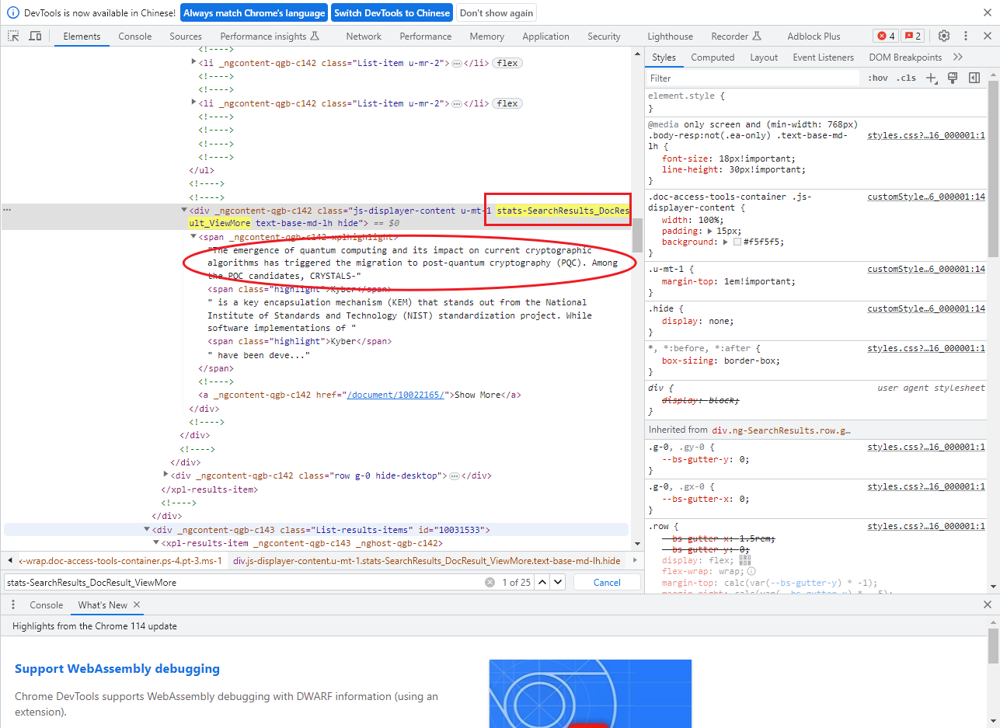

## 前言
为了统计文献
环境：
- win10
- python 3.9.12
- selenium                 4.9.1
- beautifulsoup4           4.12.2 
- requests                 2.30.0    
- json5                    0.9.11
- jsonpointer              2.3
- jsonschema               4.17.3

## 1. 保存一些无用信息

```python3
import requests
import re
def Web(url,headers):
    # 要爬取的url，注意：在开发者工具中，这个url指的是第一个url
    r = requests.get(url=url,headers=headers)
    print(r.status_code)
    #print(r.text)
    all_lines = r.text;
    all_lines = all_lines.split('\n', -1 );
    return all_lines

def GetAbstract(all_lines):
    line = ''
    for i in all_lines:
        ret = re.match('.*<meta property="twitter:description.*/>', str(i))
        if(ret):
            i = i.split('content="',1)
            i = i[1]
            i = i.split('" />',1)
            i = i[0]
            print(str(i))
            line = i
            break
    return line


if __name__ == "__main__":
    #url = "https://ieeexplore.ieee.org/document/9509281"
    #headers = {'User-Agent': 'Mozilla/5.0 (Windows NT 10.0; Win64; x64) AppleWebKit/537.36 (KHTML, like Gecko) Chrome/67.0.3396.99 Safari/537.36'}
    #all_lines = Web(url,headers)
    #line = GetAbstract(all_lines)
    #with open('gg.txt','w') as wf:
        #wf.write(line)
    url = 'https://ieeexplore.ieee.org/search/searchresult.jsp?newsearch=true&queryText=kyber'
    headers = {'User-Agent': 'Mozilla/5.0 (Windows NT 10.0; Win64; x64) AppleWebKit/537.36 (KHTML, like Gecko) Chrome/67.0.3396.99 Safari/537.36'}
    all = Web(url,headers)
    #all = GetAbstract(all)
    with open('gg.txt','w') as wf:
        for i in all:
            wf.write(i)
    wf.close()
```
## 2. 打印用户信息
摘自：[https://blog.csdn.net/wp7xtj98/article/details/112711465](https://blog.csdn.net/wp7xtj98/article/details/112711465)
```python3
#https://blog.csdn.net/wp7xtj98/article/details/112711465
import requests
from bs4 import BeautifulSoup
import re
import json

# 请求头
gheaders = {
    'Referer': 'https://ieeexplore.ieee.org/search/searchresult.jsp? \
    newsearch=true&queryText=support',
    'User-Agent': 'Mozilla/5.0 (X11; Linux x86_64; rv:27.0) \
    Gecko/20100101 Firefox/27.0',
    'Accept': 'text/html,application/xhtml+xml,application/xml;q=0.9, \
    image/avif,image/webp,image/apng,*/*;q=0.8,'
              'application/signed-exchange;v=b3;q=0.9',
    'Accept-Encoding': 'gzip, deflate, br',
    'Accept-Language': 'zh-CN,zh;q=0.9',
    'Connection': 'keep-alive'
}
# 请求链接
url = 'https://ieeexplore.ieee.org/document/4537113'
IEEE_response = requests.get(url=url, headers=gheaders)     # GET请求
soup = BeautifulSoup(IEEE_response.text, 'lxml')            # 解析
# 正则表达式 创建模式对象
pattern = re.compile(r'xplGlobal.document.metadata=(.*?);', re.MULTILINE | re.DOTALL)
script = soup.find("script", text=pattern)                  # 根据模式对象进行搜索
res_dic = pattern.search(script.string).group(1)            # 配合search找到字典
#print(res_dic)
json_data = json.loads(res_dic)                             # 将json格式数据转换为字典
print(json_data['userInfo'])                                # 测试一下。。
```
## 3. 爬取摘要并保存至CSV
改自：[https://blog.csdn.net/int888888/article/details/107231549](https://blog.csdn.net/int888888/article/details/107231549)
```python3
#https://blog.csdn.net/int888888/article/details/107231549
from selenium import webdriver
from selenium.webdriver.common.by import By
from selenium.webdriver.common.keys import Keys
from selenium.webdriver.support import expected_conditions as EC
from selenium.webdriver.support.wait import WebDriverWait
 
import json
import time
import csv
#保存信息函数CSV
def write_to_csv(csv_file, csv_input):
    with open(csv_file, 'w', encoding='utf8',newline='') as wf:
        writer = csv.writer(wf)
        writer.writerows(csv_input)
    wf.close()

#保存信息函数TXT
def write_to_file(txt_file, txt_input):
    with open(txt_file, 'w', encoding='utf-8') as wf:
        for i in txt_input:
            for j in i:
                wf.write(j + '\n')
    wf.close()


#任务：爬取2页或多页指定URL的文章摘要
def main(pageNumber, search_url):
    result = []
    browser = webdriver.Chrome()
    browser.implicitly_wait(200)#这是延时等待。由于网速时快时慢，而get方法会在网页框架加载结束后停止执行，
    #这就会导致有些时候我们打算获取的内容还没被加载进来便结束了获取页面数据，最后报错，拿不到想要的数据。
    url = search_url+str(pageNumber)
    browser.get(url)
    #遇到class name中的复合情况（即有多个class name中间是空格隔开的）
    #选取其中一个具有全局唯一性的class name即可准确定位所要查找的结点内容
    AbstractList = browser.find_elements(By.CLASS_NAME, 'stats-SearchResults_DocResult_ViewMore')
    HrefList = browser.find_elements(By.CLASS_NAME, 'fw-bold')
    for i in range(len(AbstractList)):
        #对于需要点击才显示出来的页面内容（隐藏内容）需要使用下面的方法获取文本信息
        content = browser.execute_script("return arguments[0].textContent", AbstractList[i])
        href = browser.execute_script("return arguments[0].href", HrefList[i])
        title = browser.execute_script("return arguments[0].textContent",HrefList[i])
        result.append((href, title, content,))
    return result
 
if __name__ == "__main__":
    #https://ieeexplore.ieee.org/search/searchresult.jsp?newsearch=true&queryText=kyber&highlight=true&returnFacets=ALL&returnType=SEARCH&matchPubs=true&pageNumber=2
    #以上面的链接为例,去年最后的页码2,即是下面的url链接
    url = 'https://ieeexplore.ieee.org/search/searchresult.jsp?newsearch=true&queryText=kyber&highlight=true&returnFacets=ALL&returnType=SEARCH&matchPubs=true&pageNumber='
    for i in range(2):
        j = i + 1
        result = main(pageNumber = j)
        write_to_csv('fs.csv', result)
        #time.sleep(1)#有些网站有反爬虫机制，如果访问间隔时间很短则不会响应。
```
爬的是这2个class，是因为对应的是文章链接和摘要


